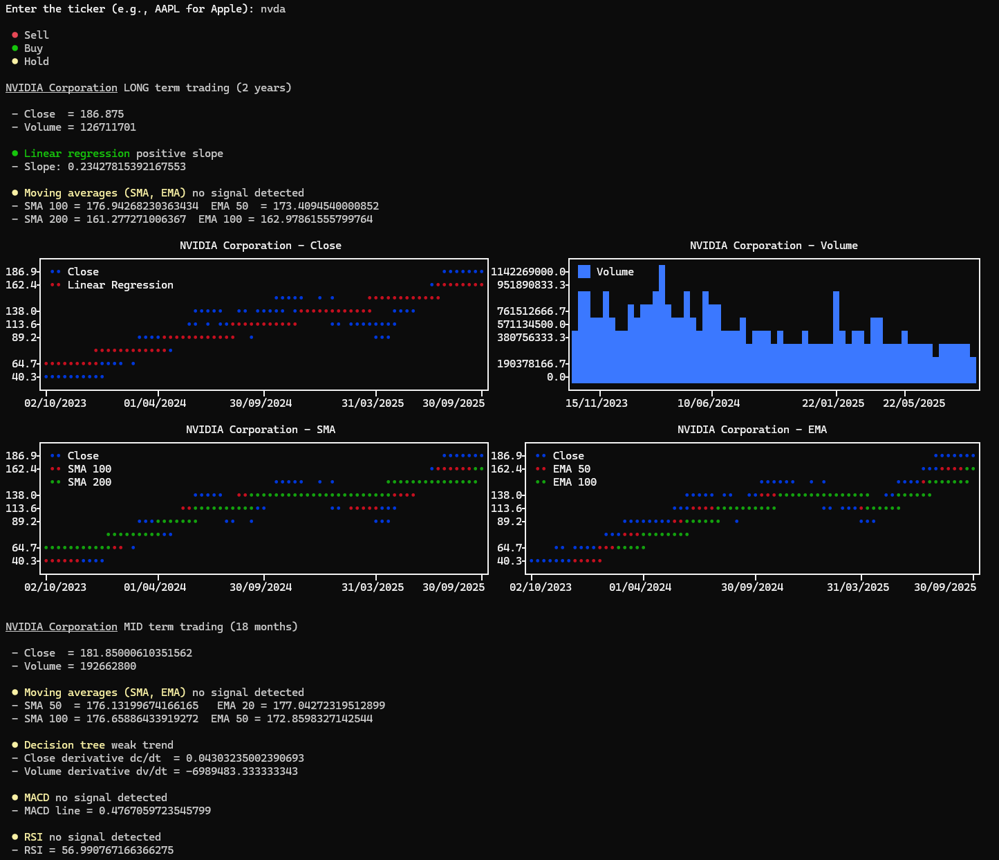
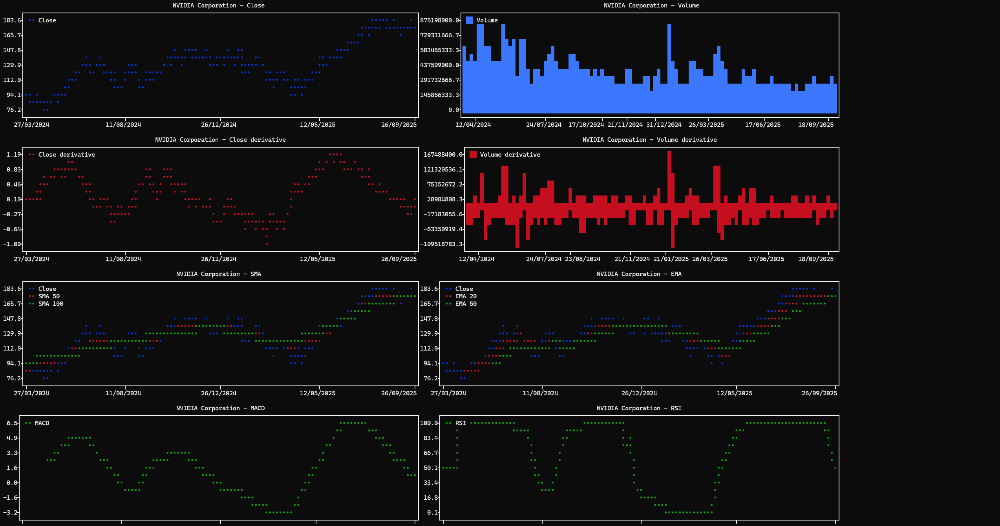

# stockanalysis
This project provides a Python-based toolkit for `financial market analysis` using data from Yahoo Finance.

It helps investors and traders make more informed decisions by applying `technical indicators`, `trend analysis`, and `signal detection on historical price and volume data.  





## Dependencies
```
numpy
yfinance
plotext
```

## Usage  
Run the script and enter the stock ticker symbol (e.g., `AAPL` for Apple, `MSFT` for Microsoft)